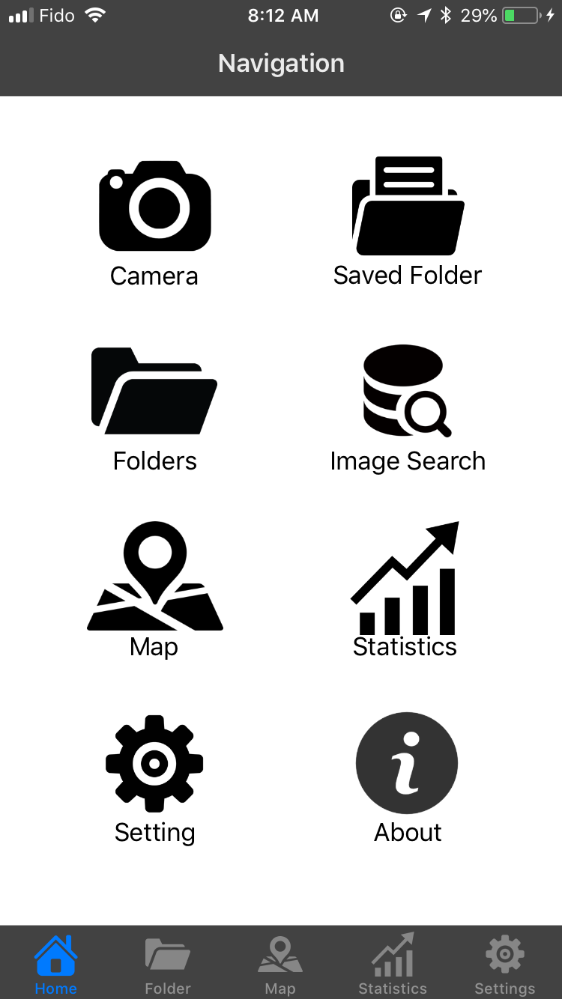

# PhotoManager
## About
- developed an iOS app that take a picture and save the picture into a folder within the app
- implemented two layer level folders
- implemented a map that shows where your photos took
- implemented a statics to show how many photo you took
- implemented layouts based on UICollectionViewController for the folder page, UITableViewController for the setting page and UITabBarController

## Home Page

## Folder Page

## Folder Details Page

## Map Page

## Statistics Page

## Settings Page

## About Page

## Hashtag

## Image Search Page

## Image View Page

